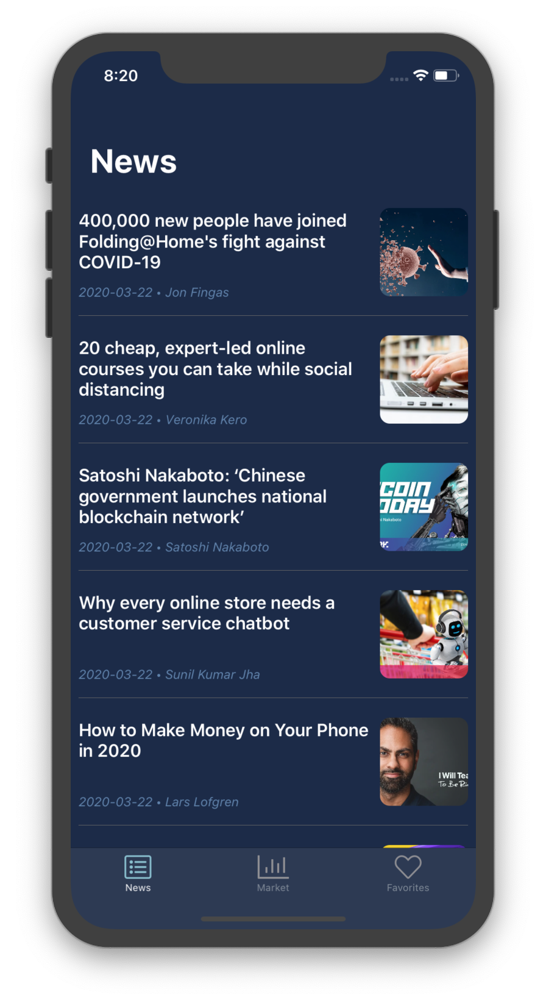

## 🚀 Welcome to CryptoMarket! 🚀

### 🧐 Overview




CryptoMarket is an app to see the current Market of cryptocurrencies 📊.
The idea of the app was to play around with [MVVM](https://en.wikipedia.org/wiki/Model–view–viewmodel) and [RxSwift](https://github.com/ReactiveX/RxSwift) on iOS 
For now, it is still a **BETA!**, not all bugs have been found yet (please report any you encounter).

### 👀 Usage

This project uses Cocoapods to manage the decencies. If you want to run the project, your first need to install the pods by doing pod install.
An API key is required and you can add your own [NewsAPI](https://newsapi.org/) key by using [cocoapods keys](https://github.com/orta/cocoapods-keys).

First install it by doing `gem install cocoapods-keys` and then add your keys and like this:

<pre>$ pod keys set MarketNewsAPIClient YOUR_API_KEY </pre>

### 🔨  Architecture

The [MVVM](https://en.wikipedia.org/wiki/Model–view–viewmodel) pattern is use throughout the application, with a heavy use of [RxSwift](https://github.com/ReactiveX/RxSwift) which makes the binding very easy 😎


All `ViewModels` expose [RxSwift](https://github.com/ReactiveX/RxSwift) observables in the form of [Drivers](https://github.com/ReactiveX/RxSwift/blob/master/Documentation/Units.md) that are perfect to use in `ViewModels` because they:
* Can't error out.
* Observe occurs on main scheduler.
* Shares side effects (share(replay: 1, scope: .whileConnected)).

`ViewControllers` can later connect to this drivers and update UI Elements, for example:

```swift
    let output = self.viewModel.transform(input: ViewModel.Input())

    output.Label
        .bind(to: self.titleLabel.rx.text)
        .disposed(by: self.disposeBag)
```    
`ViewControllers` can also connect to observables as well, for example:

```swift
    let output = self.viewModel.transform(input: ViewModel.Input())  
  
    output.collectionViewDataSource.asObservable()
        .observeOn(MainScheduler.instance)
        .subscribeOn(MainScheduler.asyncInstance)
        .subscribe(onNext: { (collectionViewDataSource) in
            self.collectionViewDataSource = collectionViewDataSource
            self.collectionViewNews.reloadData()
        }, onError: { (error) in
            self.handlePlanningError(error: error)
        }).disposed(by: self.disposeBag)
```

The communication between the `ViewControllers` and the `ViewModel` is done by the `ViewModelType` protocol, as bellow :

```swift

protocol ViewModelType {
    associatedtype Input
    associatedtype Output
    
    func transform(input: Input) -> Output
}
```
The ViewModel perform transformation of the user `Input` to the `Output`, this feature is from the [Clean Architecture](https://github.com/sergdort/CleanArchitectureRxSwift)

### ⚙️ Contributing

You’re **more than welcome** to improve and add new features to the app! I will create a backlog soon. 

### 👽 Author

I’m *Thomas Martins* iOS developer , ping me there [ThomasMartins](https://www.linkedin.com/in/thomas-martins-0343b1b7/) for any question.

### 📝 License

*CryptoMarket* is released under the MIT License. See [LICENSE](https://github.com/pixel16/CountItApp/blob/master/LICENSE) for details. 

### 🚀 Release
*The date of the release should be around the 15th December on the App Store, so be ready* 😎
